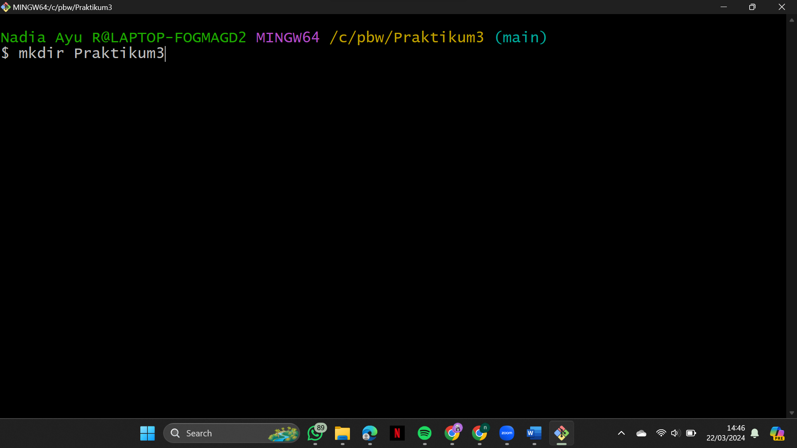

# Tugas Praktikum Pertemuan Ke-3 Pemograman Berbasis Web

## Nama: Nadia Ayu Rahmawati
## NIM: 4522210077
## MEMPELAJARI PACKAGE

---

## membuat folder baru bernama Praktikum3

## $ mkdir Praktikum3

## $ cd Praktikum3

## $ go mod init Praktikum3

## $ Mkdir ratarata

## $ CD ratarata

## Membuat file ratarata

## Pindah ke folder Praktikum3

## $ cd ..

## $ go build

## Muncul file exe

---

Terimakasih !!
