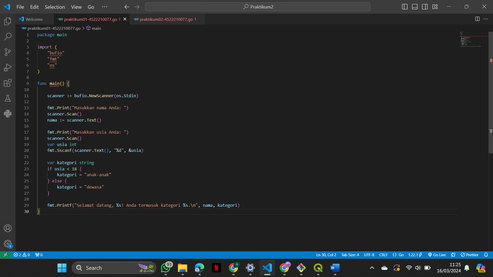
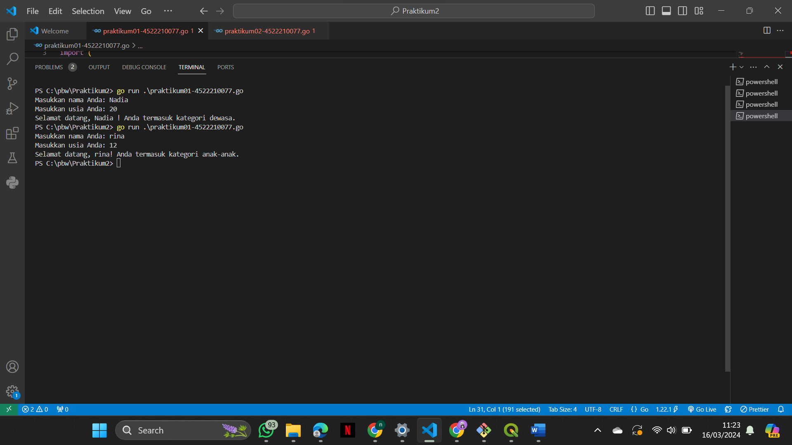
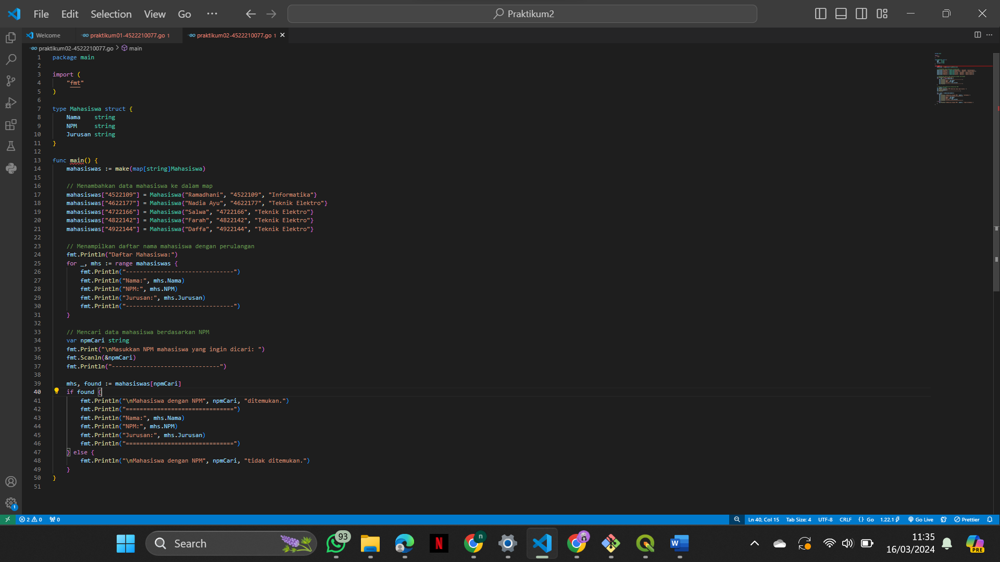
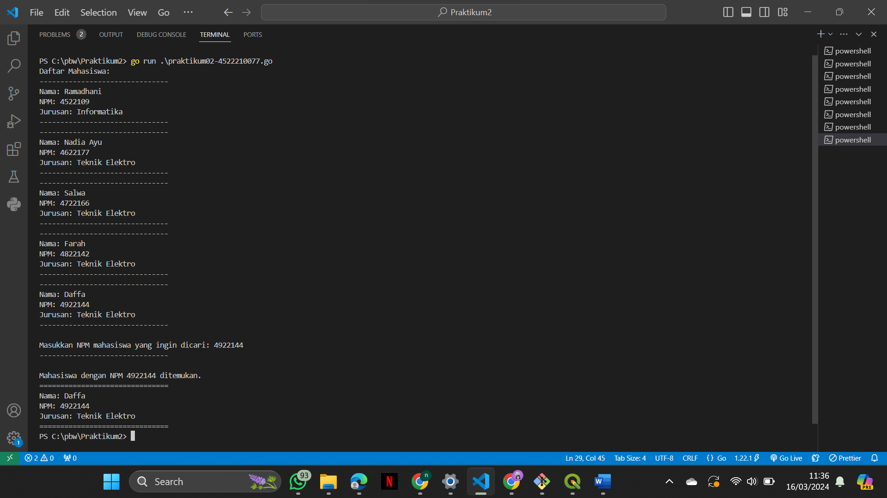
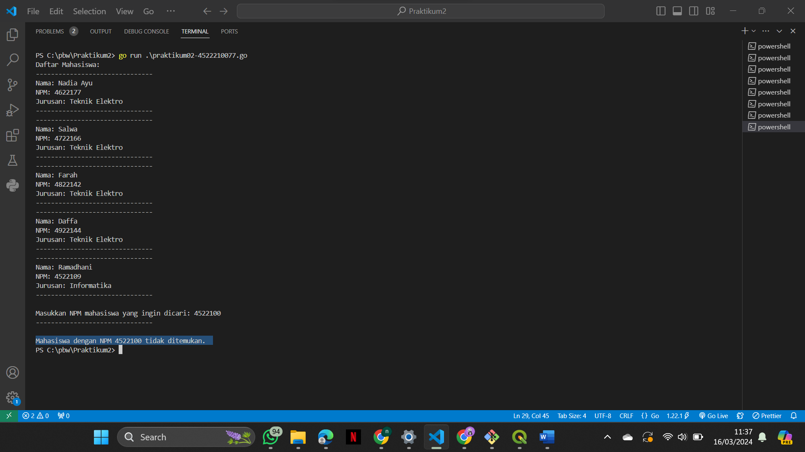
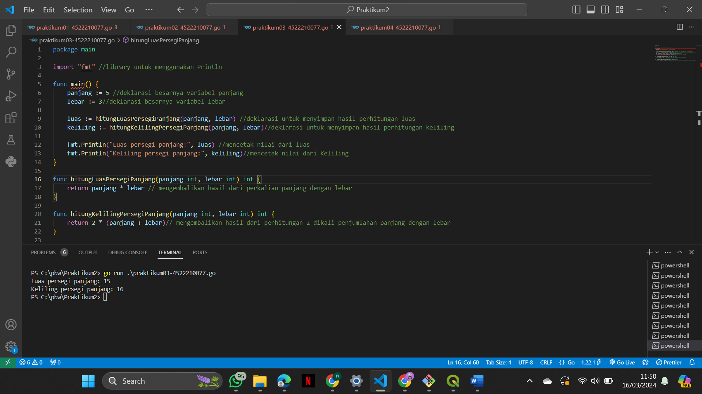
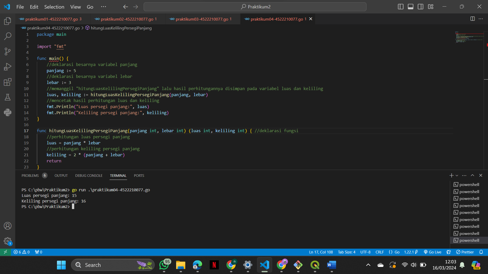

# Tugas Praktikum Pertemuan Ke-2 Pemograman Berbasis Web

## Nama: Nadia Ayu Rahmawati
## NIM: 4522210077

---

## Tugas 01 
### Screenshot

### Hasil 

---

## Tugas 02

### Hasil 

---

## Tugas 03 
### Screenshot

### Penjelasan Program
Merupakan program untuk menghitung luas dan keliling persegi panjang. Dengan menggunakan dua fungsi.Fungsi pertama bernama hitungLuasPersegiPanjang, untuk menghitung luas dari persegi panjang. Dan fungsi kedua bernama hitungKelilingPanjang, untuk menghitung Keliling dari persegi panjang.

---

## Tugas 04 
### Screenshot

### Penjelasan Program
Merupakan program untuk menghitung luas dan keliling persegi panjang. Dengan menggunakan satu fungsi bernama hitungLuasKelilingPersegiPanjang, untuk menghitung luas dan keliling dari persegi panjang

---

## Tugas 05
### Perbedaan antara Tugas 03 dan Tugas 04!
Pada tugas 3, perhitungan luas dan keliling dilakukan pada fungsi yang berbeda.Akan mengembalikan nilai dari masing-masing secara terpisah, dan harus dipanggil satu persatu fungsinya jika ingin mencetak kedua perhitungan. Jika pada tugas 4, perhitungan luas dan keliling dilakukan pada satu fungsi yang sama.Dan menghasilkan lebih dari satu nilai saat memanggil satu nama fungsi. 

---

Terimakasih !!
